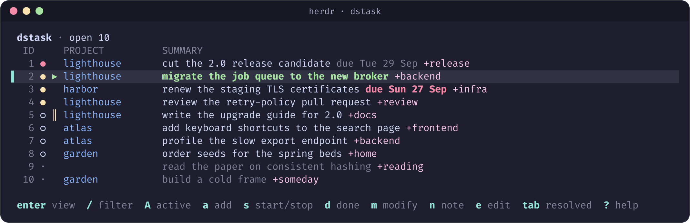
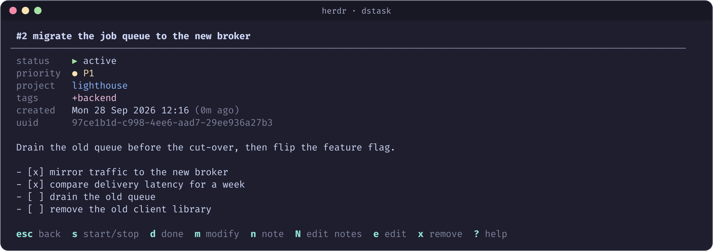
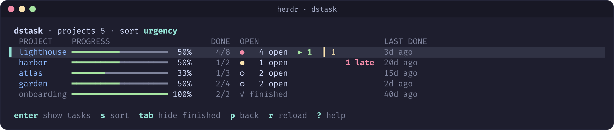

# herdr-dstask

A [Herdr](https://herdr.dev) plugin that puts [dstask](https://github.com/naggie/dstask)
in the control plane. It opens a popup with your tasks, so you can find a
task, read it and change it without leaving your agents.

The plugin reads and writes the task repository through the dstask Go
library, `github.com/naggie/dstask`. It does not run the `dstask` binary. It
uses the same repository, the same context and the same git history as the
CLI, and every change is a commit that `dstask undo` can revert.





## Install

```sh
herdr plugin install cgardner/herdr-dstask
```

That downloads the prebuilt binary for your platform from the matching GitHub
release: macOS or Linux, on arm64 or amd64. The Go toolchain is necessary only
when no release binary matches. Then the install builds from source.

## Open it

```sh
herdr plugin action invoke open --plugin cgardner.herdr-dstask
```

To open it with a key, add a binding to `~/.config/herdr/config.toml`:

```toml
[[keys.command]]
key = "prefix+t"
type = "plugin_action"
command = "cgardner.herdr-dstask.open"
description = "dstask tasks"
```

## The list

Each row shows the ID, a priority dot, a status mark, the project, the
summary, the due date and the tags.

| mark | meaning |
|---|---|
| `●` red | P0, critical |
| `●` yellow | P1, high |
| `○` | P2, normal |
| `·` dim | P3, low |
| `▶` | active (started) |
| `‖` | paused |
| `✓` | resolved |

A due date turns red when an open task is late. The list opens in the order
of `dstask next`: priority first, then the oldest task. It shows one page at a
time, and dots under the list show the pages.

The colors are the 16 colors of your terminal palette, so your terminal theme
sets them. Herdr does not share its own theme with plugins, so the colors
match Herdr only when your terminal and Herdr use the same theme. The
selected row uses `selection_bg` from your Herdr config, as Herdr's own menus
do. `HERDR_DSTASK_SELECTION_BG` overrides it with a hex color.

## Projects

`p` opens the project view, which shows how far along each project is.



Each row shows the project, a progress bar, the percent of its tasks that are
done, the done and total counts, and its highest open priority with the
number of open tasks. Then it shows how many tasks are active (`▶`), paused
(`‖`) and late, and when a task of the project was last finished.

`s` and `S` change the order, and the header names it. A `▾` marks the sorted
column:

| order | first |
|---|---|
| urgency (the default) | the highest open priority, then by name |
| progress | the largest part done |
| open | the most open tasks |
| last done | the most recently finished task |

A new order starts again at the first project. Finished projects, with no
open tasks, are hidden, and the header says how many. `tab` shows them. In
every order they come last, the most recently finished first, so they do not
push the unfinished projects down.

`/` filters the projects by name as you type. Every word must occur in the
name, and case does not matter, so `ai gov` finds `ai-governance`. The header
shows the count, such as `projects 3 of 45`, and how many finished projects
also match. `esc` clears the filter, and a second `esc` leaves the view. The
project filter is separate from the task filter, and it stays when you leave
the view and come back.

`enter` returns to the task list with the filter `project:name`, so the list
shows only that project's open tasks. `esc` clears the filter.

The counts are the ones that `dstask show-projects` gives, from the same
library call. Like that command, the view ignores the context, because a
project's progress needs all of its tasks. The view loads the resolved tasks
too, so it opens a little slower than the list: about 200 ms for 750 tasks.

## It remembers where you were

The popup opens where you left it: on the task list or the project view,
with the same filters, the same open or resolved list, the same context
setting, the same project order and filter, and the same task and project
selected. A task is found again by its UUID, so the selection survives the
ID changes that dstask makes when tasks are resolved or added. A task view,
a prompt or the help screen is not restored. The popup opens on the list
behind it.

Each repository has its own saved view, so the sandbox copy and your real
tasks never share filters. The views are kept outside the repository, in
Herdr's state folder for the plugin:

```
~/.local/state/herdr/plugins/cgardner.herdr-dstask/views/<hash>.json
```

Outside Herdr, they go to `$XDG_STATE_HOME/herdr-dstask/views`, or to
`~/.local/state/herdr-dstask/views`. Each file names its repository in the
`repo` field. Delete a file to start that repository from the defaults.
`--all` ignores the context even when the saved view does not.

## Keys

In the list:

| key | action |
|---|---|
| `j` `k` `↓` `↑` | move |
| `g` `G` | first task, last task |
| `ctrl+d` `ctrl+u` | half a page down, up |
| `→` `l` `pgdn` | next page |
| `←` `h` `pgup` | previous page |
| `enter` | open the task |
| `/` | filter by words in the summary, project, tags or notes |
| `#` | find by ID: opens the filter with `#` typed |
| `A` | show only active tasks; press again to show all |
| `space` | mark the task and move down |
| `*` | mark every task shown, or unmark them all |
| `tab` | switch between open and resolved tasks |
| `c` | switch between the dstask context and all tasks |
| `p` | open the project view |
| `r` | reload |
| `?` | help |
| `esc` | clear the marks, then the text filter, then the active filter, then quit |
| `q` | quit |

In the filter, `project:atlas` matches the tasks of that project, and
`project:` alone matches the tasks without one. `#72` matches task 72, and
`#72 #29` matches either task.
Other words then narrow the result. A number without `#` is a text search, so
a ticket number such as `3995` in a summary can still be found. `A` and `/`
work together.

These change a task, in the list and in the task view:

| key | action |
|---|---|
| `a` | add a task, in dstask syntax: `+tag project:x P1 summary` |
| `s` | start the task, or stop it if it is active |
| `d` | resolve |
| `m` | modify: `+tag -tag project:x P1 due:friday` |
| `n` | add a line to the notes |
| `N` | edit the notes in `$EDITOR` |
| `e` | edit the whole task as YAML in `$EDITOR` |
| `x` | remove, after a confirmation |
| `u` | undo the last change, as `dstask undo` does |

### Changing many tasks at once

`space` marks the task under the cursor with a `✓` and moves down, so you
can mark a run of tasks quickly. `*` marks every task in the list, or
unmarks them all. The header counts the marks. While any task is marked,
`d`, `s`, `m`, `n` and `x` change every marked task instead of the one under
the cursor:

- `d` resolves them, and `x` removes them after one confirmation.
- `m` and `n` ask once and apply the same modifiers or note line to each.
- `s` starts the marked tasks that are not active. When all of them are
  active, it stops them.

A bulk change is one git commit, so one `u` undoes all of it. It is all or
nothing: if dstask refuses one task, for example a task with an open
checklist, no task changes. Marks stay when you change the filter, and the
header warns when a filter hides a marked task. `esc` clears the marks
before it clears a filter. `e` and `N` open one task in an editor, so they
do not work on marks, and the task view always changes only its own task.
Marks are not saved when the popup closes.

In the task view, `j` `k` `g` `G` `ctrl+d` `ctrl+u` scroll the notes, `r`
reloads, and `esc` `h` `←` go back to the list.

In the project view, the movement and page keys are the same as in the list.
`enter` shows the project's tasks, `/` filters the projects by name, `s` and
`S` change the order, `tab` shows or hides finished projects, and `r`
reloads. `p` goes back to the list, and so does `esc` when no filter is set.

## Environment

The plugin uses the same variables as dstask:

| variable | effect |
|---|---|
| `DSTASK_GIT_REPO` | the repository, `~/.dstask` by default |
| `DSTASK_CONTEXT` | a context that overrides the saved one |
| `EDITOR` | the editor for `e` and `N`; `vim` when it is empty, as in dstask |
| `HERDR_DSTASK_SELECTION_BG` | the color of the selected row, such as `#313244` |

## Try it on a copy of your tasks

The `open-sandbox` action opens the plugin on a copy of `~/.dstask`, so you
can change tasks without a risk to the real ones:

```sh
herdr plugin action invoke open-sandbox --plugin cgardner.herdr-dstask
```

The copy is `$TMPDIR/herdr-dstask-sandbox`. It is made one time and then kept.
It has no git remotes, so changes and `dstask sync` in the copy cannot reach
your real repository. From a working copy, `make sandbox FRESH=1` copies your
tasks again.

## Limits

- The plugin does not sync. `dstask sync` is still necessary to push and pull.
- dstask gives a resolved task no ID, so the plugin cannot change one. `u`
  can bring back a task that you resolved by mistake.
- Templates are not supported yet. The project view counts a template or a
  recurring task in a project as an open task, as `dstask show-projects`
  does.
- The dstask library calls `os.Exit` when it cannot write a task file. If that
  occurs, the popup closes, and the terminal can stay in the alternate screen.
  `reset` repairs it.

## Development

```sh
git clone https://github.com/cgardner/herdr-dstask
cd herdr-dstask
make link
```

`plugin link` skips the `[[build]]` step, so `make link` builds the binary
first. `make help` lists every target. These are the most useful:

| target | effect |
|---|---|
| `make ci` | lint, test, and fail below 90% coverage |
| `make run` | start the UI in the current terminal, outside Herdr |
| `make list` | print the open tasks without the UI |
| `make demo` | open the UI on invented tasks |
| `make screenshot` | remake the images in `docs/images` from the demo, inside Herdr |
| `make sandbox` | open the popup on the copy of your tasks |

The binary also takes `--list`, `--all` (ignore the context) and `--version`.

The tests never touch `~/.dstask`. Documentation images show invented tasks
only. `AGENTS.md` explains the design decisions and the traps in the dstask
library.

Releases come from release-please. A `feat:` or `fix:` commit on `main` opens
a release pull request. Merging it tags the release and attaches the binaries.

## Toward Herdr integration

The UI talks to one `Backend` interface, and `internal/store` is the only
package that knows dstask. Thus a Herdr link can go in a new package with no
change to the store. Some possible next steps:

- Start an agent on a task: a key that opens a pane and prompts an agent with
  the summary and notes of the task.
- Link a task to a workspace: record the task UUID in the pane metadata, and
  show the active task of each agent in the sidebar.
- Filter by workspace: use the Herdr workspace or repository name as a
  project filter when the popup opens.
- Resolve a task when its agent reaches `done`.

## License

GPL-2.0. See `LICENSE`.
